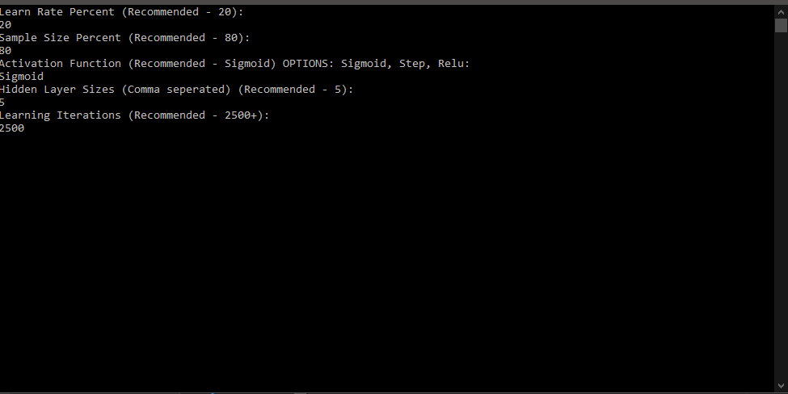
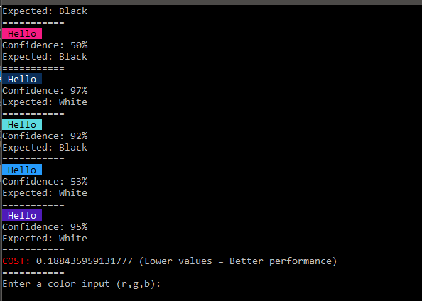

# Color-AI
This AI takes in a color as an input and then it tells if you should use black or white text.
This is a Neural Network. It is a type of AI.
It simulates the human brain. Next time I'm doing NEAT. This is overly complicated.
(it actually wasn't that bad)




Features:

```

[X] DataPoint
[X] Settings
[X] Basic Core
[X] BackPropogation

[ ] MultiThreading (Pipe Dream)

Library Mode (coming soon)
    [ ] Removed Bloat (Only backpropogation)
    [ ] Usage like:
```
```csharp

     new Network(5,2,5).Setup(activation...).Train(batchsizepercent) ... etc

```
